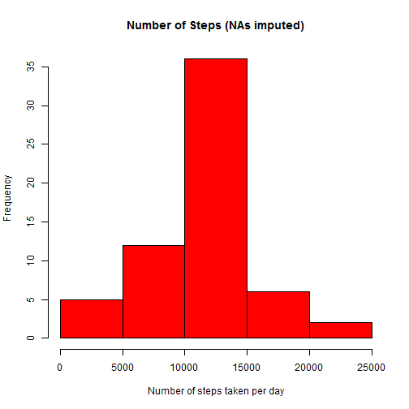

## SET GLOBAL OPTIONS

```r
library(knitr)
opts_chunk$set(echo = TRUE)
```

## LOADING AND PREPROCESSING THE DATA

```r
## validate the file exists
dataFileURL <- "https://d396qusza40orc.cloudfront.net/repdata%2Fdata%2Factivity.zip"
unzippedFilePath <- "./data/activity.csv"
if (!file.exists(unzippedFilePath))
{
	print(paste0("File '", unzippedFilePath, "' does not exist"))
	print(paste0("Download dataset ", dataFileURL, " and unzip it to 'data' directory"))
	quit()
}

## read data and set date in right format
activity <- read.csv(unzippedFilePath, stringsAsFactors = FALSE)
activity$date <- as.Date(as.character(activity$date, "YYYY-mm-dd"))
```


## WHAT IS MEAN TOTAL NUMBER OF STEPS TAKEN PER DAY?

```r
## omit the NA values for these calculations
library(dplyr)
activityNoNA <- na.omit(activity)
stepsByDay <- summarize(group_by(activityNoNA, date), stepsPerDay = sum(steps))
hist(stepsByDay$stepsPerDay, col = "red", xlab = "Number of steps taken per day",
	 main = "Number of Steps")
```


```r
print (paste("Mean of steps taken per day:", mean(stepsByDay$stepsPerDay)))
```

```
## [1] "Mean of steps taken per day: 10766.1886792453"
```

```r
print (paste("Median of steps taken per day:", median(stepsByDay$stepsPerDay)))
```

```
## [1] "Median of steps taken per day: 10765"
```

## WHAT IS THE AVERAGE DAILY ACTIVITY PATTERN?

```r
stepsByInterval <- summarize(group_by(activityNoNA, interval), meanStepsPerInterval = mean(steps))
plot (stepsByInterval$interval, stepsByInterval$meanStepsPerInterval, type = "l",
	  xlab = "Interval (minutes)", ylab = "Average steps per day",
	  main = "Average Daily Activity Pattern")
```


```r
maxAverageDF <- stepsByInterval[which.max(stepsByInterval$meanStepsPerInterval),]
print ("Maximum number of steps taken in 5 minute interval (on average):")
```

```
## [1] "Maximum number of steps taken in 5 minute interval (on average):"
```

```r
print (paste("   Interval value:", maxAverageDF$interval))	
```

```
## [1] "   Interval value: 835"
```

```r
print (paste("   Number of steps:", maxAverageDF$meanStepsPerInterval))		  
```

```
## [1] "   Number of steps: 206.169811320755"
```

## IMPUTING MISSING VALUES
## The approach is by using the mean steps taken for that interval across all days

```r
numberOfRowsWithNA <- nrow(activity) - sum(complete.cases(activity))
print (paste("Total number of rows with NAs:", numberOfRowsWithNA))
```

```
## [1] "Total number of rows with NAs: 2304"
```

```r
## function imputes NA steps by using the mean steps taken for that interval
imputeSteps <- function (activity, meanStepsByInterval)
{
	for (idx in 1:nrow(activity))
	{
		if (is.na(activity[idx,]$steps))
		{
			intervalNA <- activity[idx,]$interval
			meanStepsForInterval <- filter(meanStepsByInterval,
										   interval == intervalNA)$meanStepsPerInterval
			activity[idx,]$steps <- round(meanStepsForInterval)
		}
	}
	return (activity)
}
activityImputed <- imputeSteps(activity, stepsByInterval)

stepsByDayImputed <- summarize(group_by(activityImputed, date), stepsPerDay = sum(steps))
hist(stepsByDayImputed$stepsPerDay, col = "red", xlab = "Number of steps taken per day",
	 main = "Number of Steps (NAs imputed)")
```



```r
print (paste("Mean of steps taken per day (imputed):", mean(stepsByDayImputed$stepsPerDay)))
```

```
## [1] "Mean of steps taken per day (imputed): 10765.6393442623"
```

```r
print (paste("Median of steps taken per day (imputed):", median(stepsByDayImputed$stepsPerDay)))
```

```
## [1] "Median of steps taken per day (imputed): 10762"
```

### By imputing steps, the mean steps per day has dropped by 0.55 step which is not significant!

## ARE THERE DIFFERENCES IN ACTIVITY PATTERNS BETWEEN WEEKDAYS AND WEEKENDS?

```r
library(lattice)
activityImputed$day <- weekdays(activityImputed$date)
activityImputed$wdaywend <- apply(activityImputed, 1, function(x)
									{
										if ( (x[4]== "Saturday") | (x[4]== "Sunday") )
										{
											return("weekend")
										}
										else
										{
											return ("weekday")
										}
									})
activityImputed$wdaywend <- as.factor(activityImputed$wdaywend)
stepsByIntervalImputed <- activityImputed %>%
		select(wdaywend, interval, steps)%>%
		group_by(wdaywend, interval) %>%
		summarize(meanStepsPerInterval = mean(steps))
xyplot(meanStepsPerInterval ~ interval | wdaywend, data = stepsByIntervalImputed, layout = c(1,2),
	   type = "l", xlab = "Interval (minutes)", ylab = "Number of Steps")
```


